# Product Management API

This is a simple RESTful API for managing products. It allows users to perform CRUD operations (Create, Read, Update, Delete) on product data.

## Table of Contents
1. [Introduction](#introduction)
2. [Installation](#installation)
3. [API Endpoints](#api-endpoints)
   - [Get All Products](#get-all-products)
   - [Get Product by ID](#get-product-by-id)
   - [Create a New Product](#create-a-new-product)
   - [Update a Product](#update-a-product)
   - [Delete a Product](#delete-a-product)
   - [Sort Products by Name and Price](#sort-products-by-name-and-price)
4. [Testing with Postman](#testing-with-postman)

## Introduction

This API allows you to perform CRUD operations on product data. You can:
- Fetch all products
- Fetch a product by ID
- Add a new product
- Update a product's details
- Delete a product
- Sort products by name and price

---

## Installation

### 1. Clone the repository
git clone https://github.com/tonystark5683/product-api.git

### 2. Install dependencies
cd product-api
npm install

### 3. Start the server
npm start
The server will start running on `http://localhost:3000`.

---

## API Endpoints

### Get All Products

**Method:** GET  
**Endpoint:** /products

This route returns a list of all products.

#### Example Request:
GET http://localhost:3000/products

#### Example Response:
[
  {
    "id": 1,
    "name": "Product 1",
    "description": "Description for product 1",
    "price": 10.99,
    "quantity": 20
  },
  ...
]

#### Screenshot:
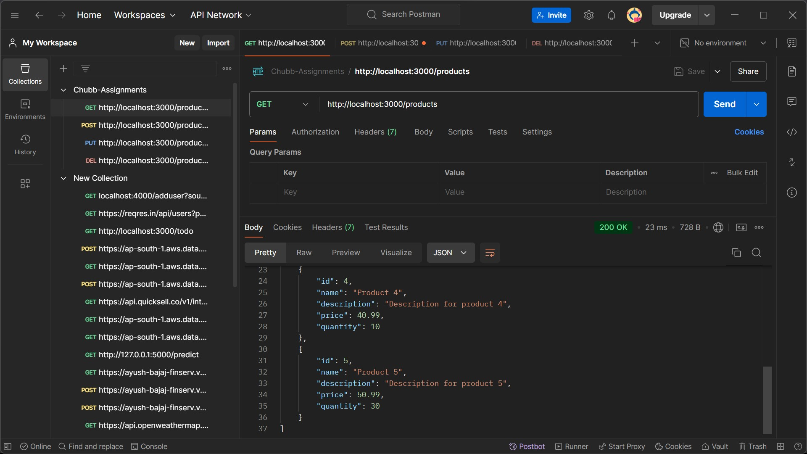

---

### Get Product by ID

**Method:** GET  
**Endpoint:** /products/:id

This route returns a product by its ID.

#### Example Request:
GET http://localhost:3000/products/1

#### Example Response:
{
  "id": 1,
  "name": "Product 1",
  "description": "Description for product 1",
  "price": 10.99,
  "quantity": 20
}

#### Screenshot:
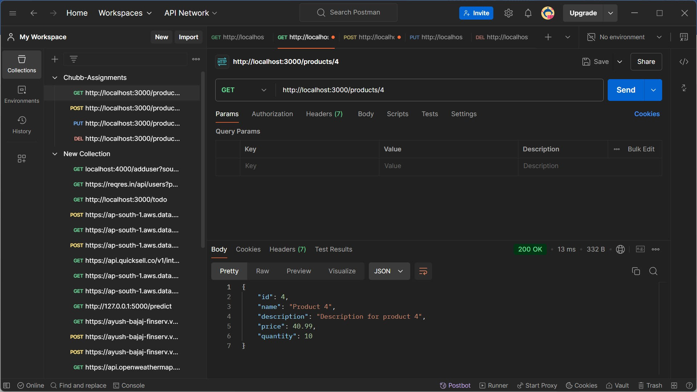
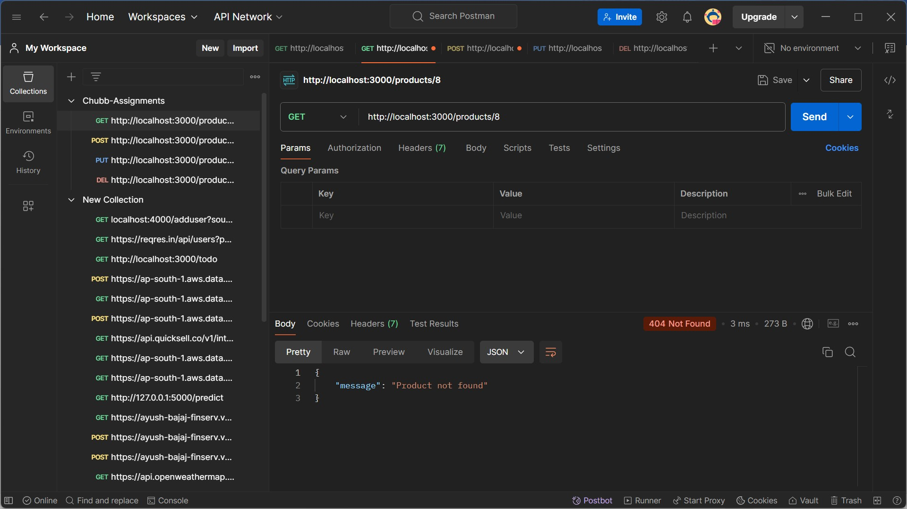

---

### Create a New Product

**Method:** POST  
**Endpoint:** /products

This route allows you to create a new product.

#### Example Request:
POST http://localhost:3000/products  
Content-Type: application/json

#### Body:
{
  "name": "Product 6",
  "description": "Description for product 6",
  "price": 60.99,
  "quantity": 25
}

#### Example Response:
{
  "message": "Product added successfully"
}

#### Screenshot:
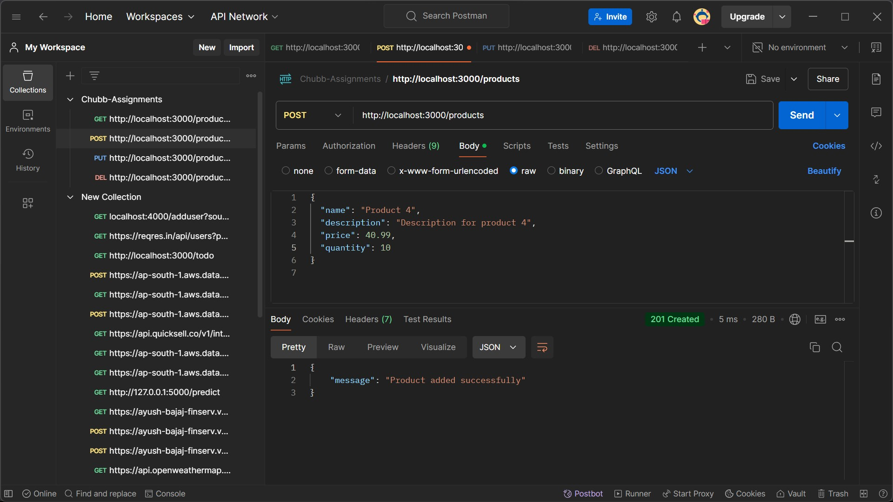
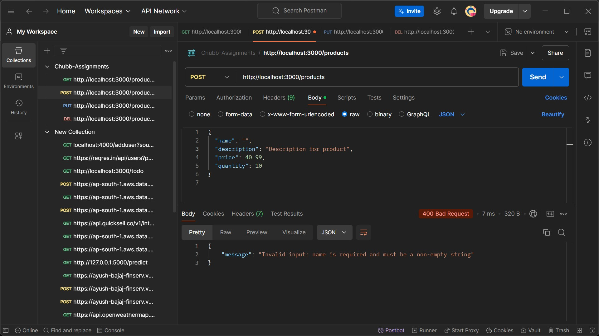
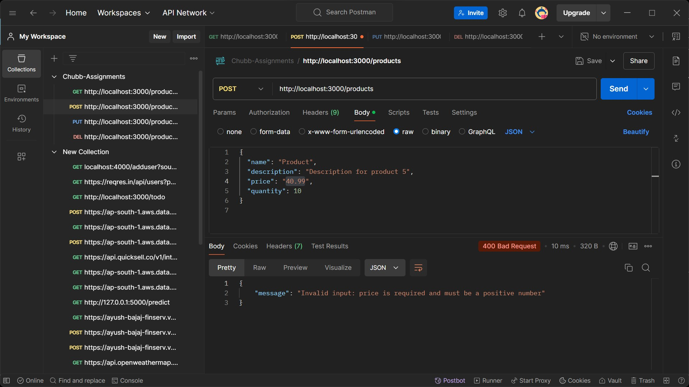

---

### Update a Product

**Method:** PUT  
**Endpoint:** /products/:id

This route allows you to update an existing product by its ID.

#### Example Request:
PUT http://localhost:3000/products/1  
Content-Type: application/json

#### Body:
{
  "price": 55.99,
  "quantity": 30
}

#### Example Response:
{
  "id": 1,
  "name": "Product 1",
  "description": "Description for product 1",
  "price": 55.99,
  "quantity": 30
}

#### Screenshot:
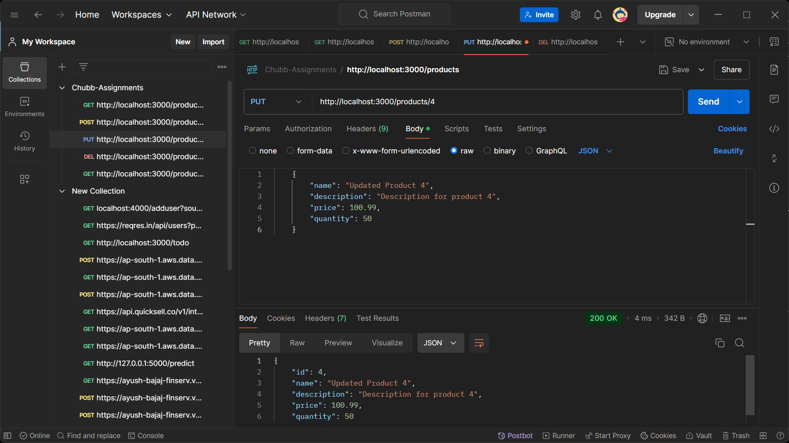
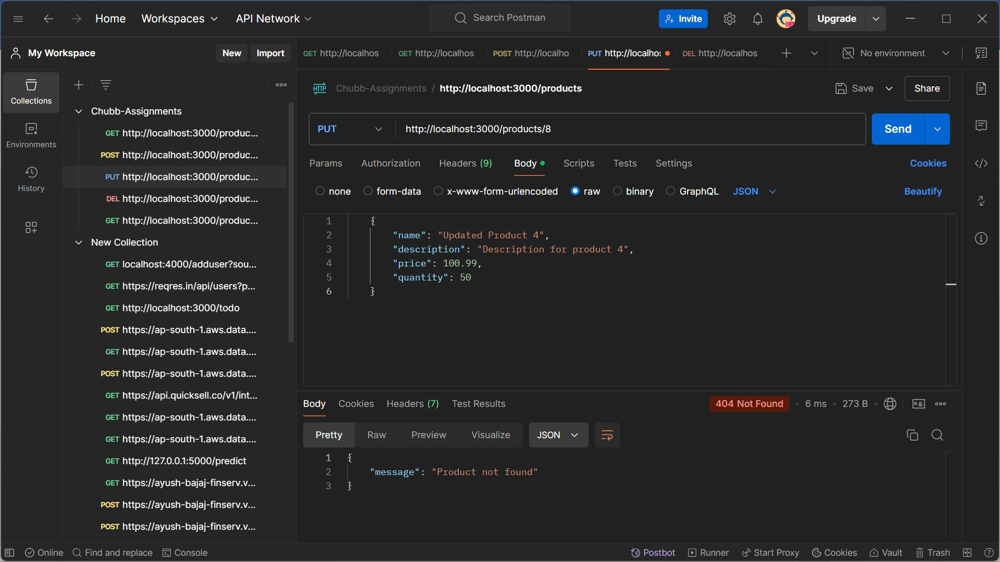

---

### Delete a Product

**Method:** DELETE  
**Endpoint:** /products/:id

This route allows you to delete a product by its ID.

#### Example Request:
DELETE http://localhost:3000/products/1

#### Example Response:
{
  "message": "Product Deleted Successfully"
}

#### Screenshot:
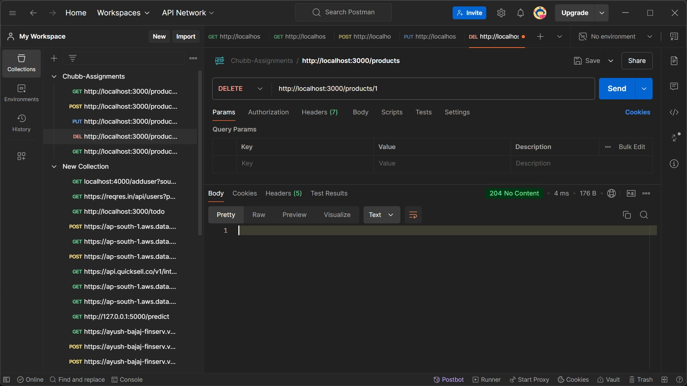
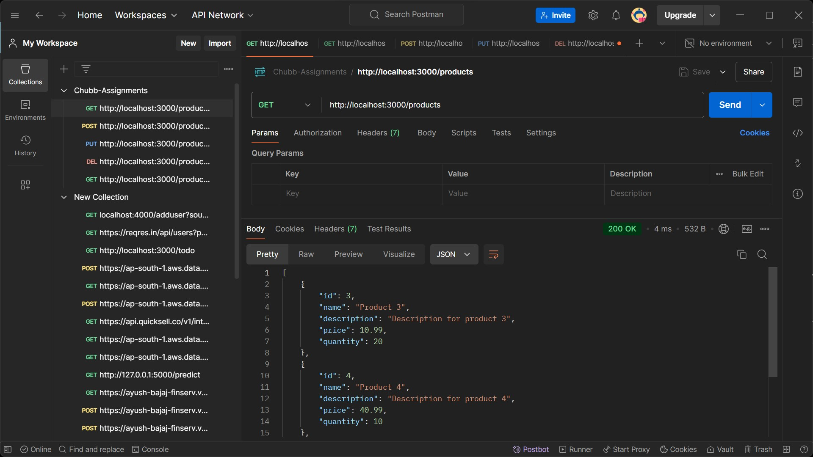

---

### Sort Products by Name and Price

**Method:** GET  
**Endpoint:** /products/sort

This route allows you to sort products by name or price in ascending or descending order.

#### Example Request:
GET http://localhost:3000/product/sort?by=name&order=asc

#### Example Response:
[
  {
    "id": 1,
    "name": "Product 1",
    "description": "Description for product 1",
    "price": 10.99,
    "quantity": 20
  },
  ...
]

#### Screenshot:
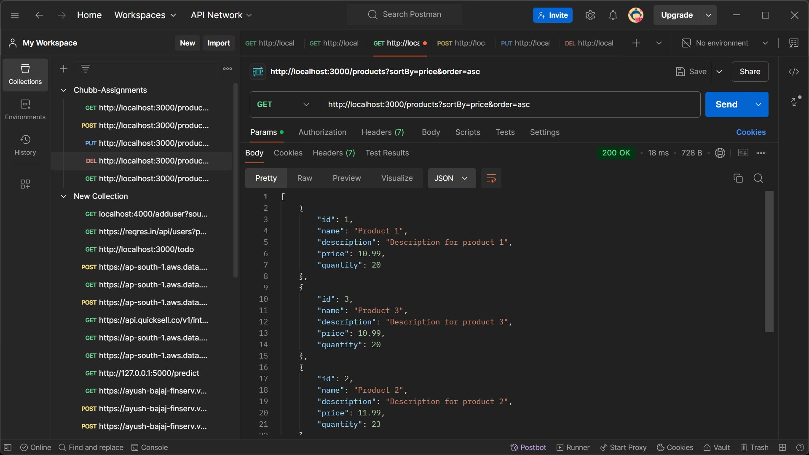
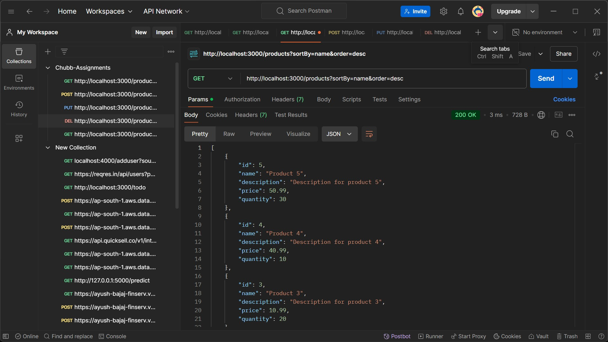

---

## Testing with Postman

To test the API with Postman, follow the steps below for each route:

1. **Get All Products:**
   - Method: `GET`
   - URL: `http://localhost:3000/products`

2. **Get a Product by ID:**
   - Method: `GET`
   - URL: `http://localhost:3000/products/1`

3. **Create a New Product:**
   - Method: `POST`
   - URL: `http://localhost:3000/products`
   - Body (JSON):
     {
       "name": "Product 6",
       "description": "Description for product 6",
       "price": 60.99,
       "quantity": 25
     }

4. **Update a Product:**
   - Method: `PUT`
   - URL: `http://localhost:3000/products/1`
   - Body (JSON):
     {
       "price": 55.99,
       "quantity": 30
     }

5. **Delete a Product:**
   - Method: `DELETE`
   - URL: `http://localhost:3000/products/1`

6. **Sort Products:**
   - Method: `GET`
   - URL: `http://localhost:3000/product/sort?by=name&order=asc`

You can import these requests into Postman to test the API.

---

## Conclusion

This API provides basic CRUD functionality for managing products along with a sorting feature. 

---

